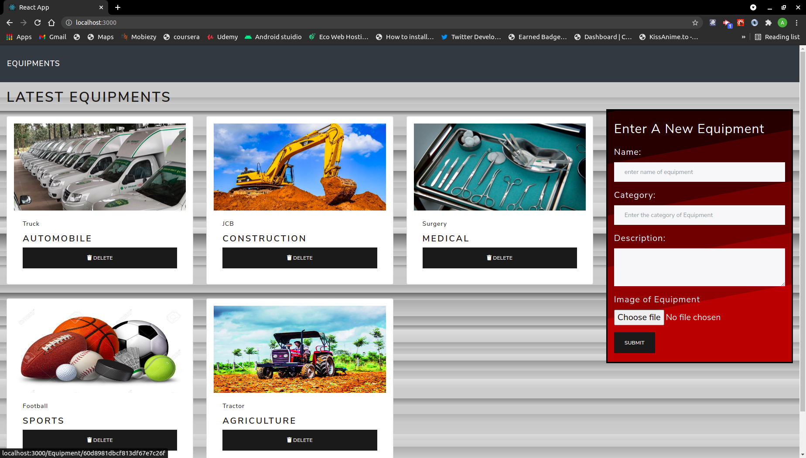

# Getting Started with Create React App

This project was bootstrapped with [Create React App](https://github.com/facebook/create-react-app).

## Available Scripts

In the project directory, you can run:

### `npm start`

Runs the app in the development mode.\
Open [http://localhost:3000](http://localhost:3000) to view it in the browser.

The page will reload if you make edits.\
You will also see any lint errors in the console.

## Equipment Details Project
A MERN project where user can enter the details of an equipment which can belong to any of the category of equipments, all the crud operations can be performed on it
frontend -react, redux, react-bootstrap
backend  -node ,express,mongodb

